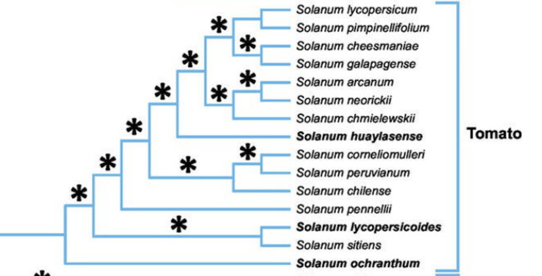

# _Solanum sp._ Chromosomes 1, 7, and ASR locus (chr. 4)

## Introduction

_Solanum_ is a large genus of over 1200 species of flowering plants in the nightshade family _Solanaceae_. This includes many economically important species like tomatoes (_S. lycospericum_), eggplant (_S. melongena_), and potatoes (_S. tuberosum_). The phylogeny is complex, but mostly contains two larger clades ([Messeder et. al.](https://doi.org/10.1111/nph.19849)), of which Clade I contains tomatoes (informally, section _Lycopersicon_). 

Moderm tomatoes are mostly varieites of _S. lycospericum_, but wild species and wild-crop hybrids grow readily in warm regions of the Americas. It is proposed that _S. pimpinellifolium_ may be a wild ancestor of modern tomatoes, and may have contributed a significant portion of genetic material to _S. lycospericum_. However, more recent admixture has occured, either naturally by intentional breeding, that has conferred traits like disease resistance into moderm varieties ([Menda et. al.](https://doi.org/10.1186/s12870-014-0287-2))

Here, I propose an analysis on chromosomes 1 and 7 of the tomato genome to detect introgressive and selective signals, particularly at loci connected to drought tolerance (below):

- __Chromosome 1__ (SlAREB1, PRXIIF, SAP5, REF4-1, LCD, CCD1, SCS)
- __Chromosome 7__ (Sec14-like PITP, AHG2, PRXQ, CFS1)
- __ASR locus (Chromosome 4)__ (ASR1 and ASR4)

## Methods

This analysis will leverage SNP data from the __Sol Genomics Network__'s ["varitome project"](https://solgenomics.sgn.cornell.edu/projects/varitome). First we will convert vcf files to hdf5, extract relevant samples, and perform PCA, nucleotide diversity, pairwise Fst, and D+ tests.